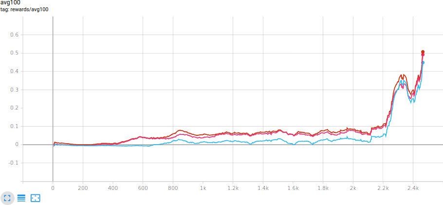
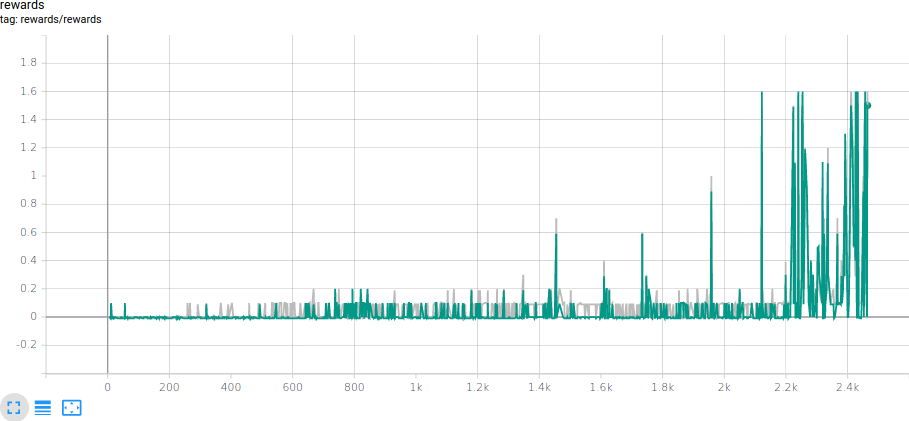
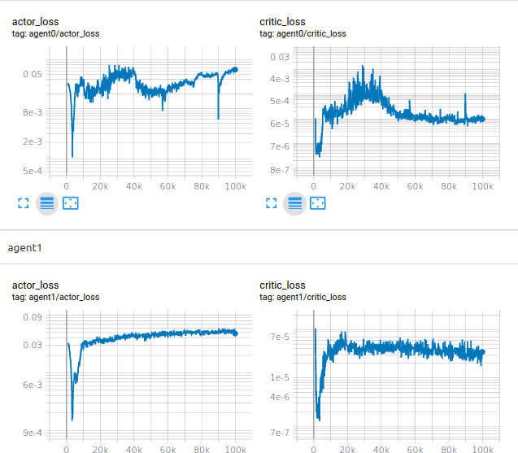

# Project report

## Introduction

Some tasks require that there are more than one agent acting with the environment. This can be cooperative, like with building a building, or antagonistic, futuristic military skirmishes.
The difficulty in such tasks comes from the agent responding not only to the environment which has its own laws, but also to other agents who have their own agendas, rarely being a stationary.

In this project we enjoyed a tennis environment where two virtual agents were having fun. The goal was sustain their enjoyment for as long as possible, or until enough fun was obtained.

## Experiment

Two agents have volunteered to participate in our ball bouncing study for indefinite amount of time, divided into episodes for ease of reference.
Their goal was to maximise accumulated reward; points were given for each successful bounce to opponents side (+0.1 for the bouncer) and reduced when a ball a ground (-0.01 for ground owner).
Such scoring gives an incentive to continue bouncing ball back-and-forth for as long as possible. Fortunately the environment limits the number of steps per episode.
Each agent is described by 8 or 24 state values. The ambiguity comes from discrepancy from all available environment descriptions and what is observed. This, however, doesn't significantly affect the experiment since the goal, i.e. showing that the model is capable to teach agents the environment, does not depend on the state space size.

The environment is considered solved when over 100 episodes the sum of best rewards per episode are at least 50 (average 0.5).

## Method

We used the Multi Agent Deep Deterministic Policy Gradient (MADDPG) to control our agents. Details of the method are described in a [paper by OpenAI team with collaborators](https://papers.nips.cc/paper/7217-multi-agent-actor-critic-for-mixed-cooperative-competitive-environments.pdf). The method uses Deep Deterministic Policy Gradient (DDPG) to control individual agents, however, the critic networks are shared between all agents. Sharing and training is done through sampling on a replay buffer.

In addition to the MADDPG we have applied [Parameter Noise](https://openai.com/blog/better-exploration-with-parameter-noise/) modelled as Gussian noise. Although many, as suggested in the paper, use the  Ornstein-Uhlenbeck process to generate the noise, we didn't find any advantage over the Gaussian noise which is easier to generate and predict. Such augmentation helps agents to explore the state space. We also found that the noise isn't even necessary for the agents to obtain the goal. The random weights initialization was enough for agents to start exploring the space; luckily their starting position isn't far from where the ball lands.

## Hyperparameters

It's been empirically verified that the task completion is heavily relayed on a proper hyperparmeter tuning. Through testing we noticed that a wide range of hyperparameters gives relatively fasts and relatively good results (0.3 average reward over 100 episodes) but then it either oscillates. Our final solution have been configured with the following parameters

|    Name       | Value | Description |
|---------------|-------|-------------|
|Batch size     | 500   | Number of samples retrieved from the replay buffer at training session.
|Buffer size    | 2e5   | Number of last samples stored in the buffer and available for retrieval.
|Warm up period | 1e3   | Number of samples since the initiation when the model wasn't training.
|Noise scale    | 1.2   | The amplitude of the noise generated.
|Noise sigma    | 0.45  | Value related to how quickly the noise process converges to the mean.
|Learning rate  | 1e-3  | Learning rates for Adam optimizers
|Gamma          | 0.99  | Discount factor used in the reward scaling.
|Tau            | 0.006 | The amount used in the soft update.
|Soft update rate   | 4 | Number of steps between each soft update
|Layers         | (400, 300) | Dimensions for fully connected hidden layers
|Gradient clip  | 1.0   | Clip value for the critic update gradient.

## Results

All figures below are copied from an attached TensorBoard which was used to monitor the experiment. The author is not yet capable to assign colours to specific lines for which he deeply apologises.

The figure below shows the progress on obtained reward for the last 100 episodes. Blue and less-red red (bottom one) lines relate to agent specific average rewards, and the more-red red (top one) line is an average of the best rewards per episode. One can see that for the first 500 episodes rewards are tiny and that's likely because one of agents is performing poorly. After that there's a minor improvement and steady increase until around 2200 episode where the less-performing agent finally gets. Shortly after both agents learn how to cooperate.

The figure below shows rewards per episode per agent. The green reward relates to the less-red red shown in the figure above.

In addition to visualizing score, we show the progress of learning through showing agents' actor and critic losses in log scale. One can see that critic values are relatively low from the very beginning and don't change much throughout the game. Actor losses, however, have higher variance, especially agent0. 

## Conclusion

The main challenge of the task was to fine-tune hyperparameters, especially the amount of noise. With too much noise agents would return extreme actions and end up on either side of their ground. With too little noise agents are dependent on the network initiation which may not be random enough preventing the exploration. We have found that the amount of noise improve learning only initially when agents don't know what to do but it inhibits it when we have collected enough different states. We used this observation to adjust the amount of noise that we inject to the system, to be based on recent episodes. It have empirically improved learning by disrupting an agent that wasn't contributing to the reward.

When running experiments we also found that setting up small learning rates and infrequent updates almost always, albeit slowly, reached the desired goal. A more aggressive set-up has resulted in adequately more aggressive progress; if agents learned to play they would have learned much quicker but most often they would converge into a no return position.

We have also observed an interesting phenomenon that we aren't sure what to attribute to. In majority of our experiments we saw that the average reward function would contain oscillations with relatively steady frequency and amplitude (probably) dependent on the hyperparameters' values. None of agents' properties have periodic behaviour we are expecting that this might be either a result of the environment property or the model itself.

## Improvements

As it has been observed, agents are capable of much faster learning though the authors are not capable of doing that consistently. We are expecting that experience sampling would take a significant role in training. In the beginning, agents don't have much experience and it's likely of poor quality. Given buffer and batch size of 2e5 and 500, respectively, after about 1e3 iterations agent will have 50% probably to chose a previous experience. Doing this after every iteration for the next 10 iterations they will likely learn from each iteration 5 times, quickly imprinting these values. After, say, 4e4 iterations the buffer is still not full and taking 500 samples gives much lower probability for take the new samples. This means that until the game becomes more stable we are overemphasing initial states which were obtained when agents didn't know how to behave. We would like to mitigate this issue by introducing a prioritisation buffer or adjusting batch size to be dependent on the episode number, thus to even out the unjust sampling.

We would also like to understand the source behind oscillations in rewards. Ideally we would like to tune our agents to stay on peaks without going to valleys.

It's unclear how our agents are robust and whether they learned to play the game or simply found a sequence of states to follow. Modifying the environment, e.g. changing gravity factor or ball's elasticity, would be an interesting test to see how good our agents understand the environment. We are expecting that each change would require additional learning sequence but hopefully having base agents we could utilize their networks and increase learning rates to quickly adjust to the new state.
